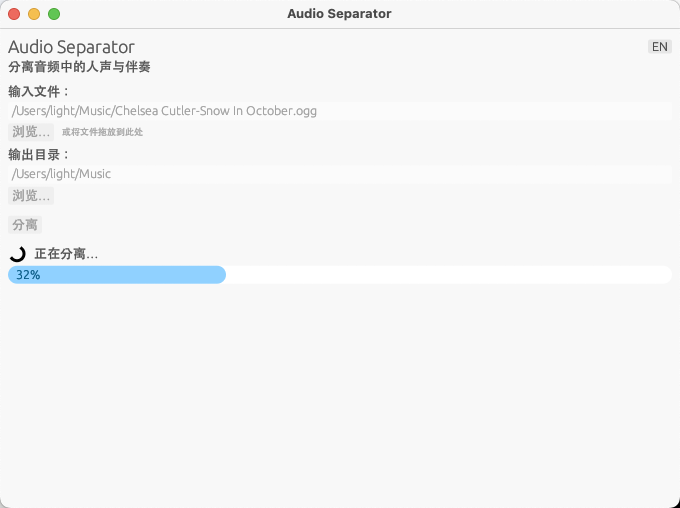

<div align="center">

# Audio Separator

**AI 驱动的音频人声/伴奏分离工具**

支持 MP3 / FLAC / OGG 输入 · 内置图形界面 · 模型内嵌 · 双击即用

[](LICENSE) [](https://www.rust-lang.org/)

</div>

---

## 界面预览



## 特性

| | |
|:---|:---|
| **图形界面** | 内置 GUI，支持中英文切换、拖放文件、原生文件选择器 |
| **CLI 模式** | 完整的命令行界面，适合脚本和自动化场景 |
| **模型内嵌** | ONNX 模型编译进二进制文件，无需联网下载 |
| **双击即用** | macOS `.app` 包，双击启动，不弹终端，无需任何依赖 |
| **高质量分离** | 基于 MDX-Net (Kim_Vocal_1) 深度学习模型，分离效果优秀 |
| **多格式支持** | 输入 MP3 / FLAC / OGG，输出 WAV（保留原始采样率） |

## 支持的格式

| 输入格式 | 输出格式 | 说明 |
|----------|----------|------|
| `.mp3` | `.wav` | MP3 解码后分离 |
| `.flac` | `.wav` | FLAC 无损解码后分离，自动重采样 |
| `.ogg` | `.wav` | OGG/Vorbis 解码后分离 |

输出为两个 WAV 文件：`*_vocals.wav`（人声）和 `*_accompaniment.wav`（伴奏）。

## 安装

### 从 Release 下载（推荐）

前往 [Releases](https://github.com/ownlight6/audio-separator/releases) 下载对应平台的构建产物：

- **macOS**：下载 `audio-separator-macos-arm64-app.tar.gz`（Apple Silicon）或 `audio-separator-macos-x86_64-app.tar.gz`（Intel），解压后双击 `Audio Separator.app` 即可使用
- **Windows**：下载 `audio-separator-windows-x86_64.zip`，解压后运行 `audio-separator.exe`

### 从源码编译

**前置要求：**
- Rust 1.70+（推荐使用 [rustup](https://rustup.rs/) 安装）
- ONNX Runtime（macOS: `brew install onnxruntime`）
- [Kim_Vocal_1.onnx](https://github.com/TRvlvr/model_repo/releases/download/all_public_uvr_models/Kim_Vocal_1.onnx) 模型文件（放在项目根目录，编译时自动嵌入）

```bash
git clone https://github.com/ownlight6/audio-separator.git
cd audio-separator

# 下载模型（编译时自动嵌入二进制文件）
curl -LO https://github.com/TRvlvr/model_repo/releases/download/all_public_uvr_models/Kim_Vocal_1.onnx

# 编译（默认包含 GUI）
cargo build --release

# 生成 macOS .app 包
./scripts/create-app-bundle.sh
```

> 如果项目目录中没有 `Kim_Vocal_1.onnx`，编译产物将在首次运行时自动下载模型。

### 仅编译 CLI（无 GUI）

```bash
cargo build --release --no-default-features
```

## 使用

### 图形界面

```bash
# 直接运行（无参数）自动启动图形界面
audio-separator

# 或显式指定
audio-separator --gui
```

- **文件选择** — 点击"浏览"按钮选择文件，或直接拖放文件到窗口
- **输出目录** — 默认与输入文件同目录，可自定义
- **中英文切换** — 右上角语言按钮
- **进度显示** — 实时显示当前阶段和进度条

### 命令行

```bash
# 基本用法
audio-separator /path/to/song.mp3

# 指定输出目录
audio-separator /path/to/song.flac -o /path/to/output/

# 使用自定义模型
audio-separator --model /path/to/custom.onnx /path/to/song.ogg
```

<details>
<summary>完整参数</summary>

```
audio-separator [OPTIONS] [INPUT]

Arguments:
  [INPUT]   输入音频文件（MP3、FLAC、OGG）

Options:
  -o, --output <DIR>     输出目录（默认同输入文件目录）
      --model <PATH>     ONNX 模型文件路径（默认使用内嵌模型）
      --gui              启动图形界面
  -h, --help             显示帮助
  -V, --version          显示版本
```

</details>

## 技术细节

### 分离管线

```
输入文件 (MP3/FLAC/OGG)
    ↓
[symphonia] 解码为 PCM 采样
    ↓
[rubato] 重采样至 44100 Hz（如需要）
    ↓
[realfft] STFT 短时傅里叶变换（n_fft=6144, hop=1024）
    ↓
[ort] MDX-Net ONNX 模型推理（分块处理 + 重叠融合）
    ↓
[realfft] ISTFT 逆变换，重建人声波形
    ↓
伴奏 = 原始信号 - 人声
    ↓
[rubato] 重采样回原始采样率（如需要）
    ↓
[hound] 输出 WAV 文件
```

### 使用的模型

- **Kim_Vocal_1** (MDX-Net) — 专为人声/伴奏分离优化的深度学习模型
- 输入维度：`[batch, 4, 3072, 256]`（立体声复数 STFT：实部+虚部 × 2通道）
- 来源：[UVR Model Repo](https://github.com/TRvlvr/model_repo)

### 依赖说明

| 库 | 用途 |
|----|------|
| `symphonia` | 纯 Rust 音频解码（MP3/FLAC/OGG） |
| `hound` | WAV 文件写入 |
| `ort` | ONNX Runtime Rust 绑定（ML 推理） |
| `realfft` | 实数 FFT（STFT/ISTFT） |
| `rubato` | 高质量音频重采样 |
| `egui` / `eframe` | 跨平台 GUI 框架 |
| `rfd` | 原生文件选择对话框 |

## 项目结构

```
src/
├── main.rs          — CLI/GUI 双模式入口，自动定位 ONNX Runtime
├── lib.rs           — 库导出：separate_file() 完整分离管线
├── gui.rs           — egui 图形界面（中英文双语）
├── audio_io.rs      — 音频解码/编码/重采样
├── separator.rs     — STFT + MDX-Net ONNX 推理 + ISTFT
└── model_manager.rs — 模型内嵌/下载/缓存管理
build.rs             — 检测模型文件，条件编译嵌入
macos/
└── Info.plist       — macOS .app 包配置
scripts/
└── create-app-bundle.sh — macOS .app 打包脚本
imgs/
└── gui.png          — GUI 界面截图
```

## 许可证

本项目基于 [GNU General Public License v3.0](LICENSE) 许可证开源。
